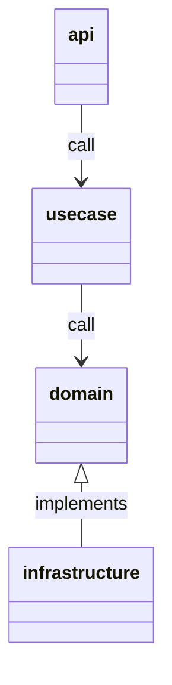

# realworld-echo

## Quickstart

```console
make init
go run .
```

## Libraries

| lib            | use                            |
| -------------- | ------------------------------ |
| zap            | logging                        |
| echo           | web framework                  |
| oapi-codegen   | schema base OAS code generator |
| eri            | error utility                  |
| go-cmp         | test compare                   |
| wire           | dependency injection           |
| opentelemetory | tracing                        |

## About Component

| component      | usage                                 |
| -------------- | ------------------------------------- |
| api            | API handler                           |
| usecase        | Implements application business logic |
| domain         | Implements domain logic               |
| infrastructure | Implements technical logic            |

### Diagram


