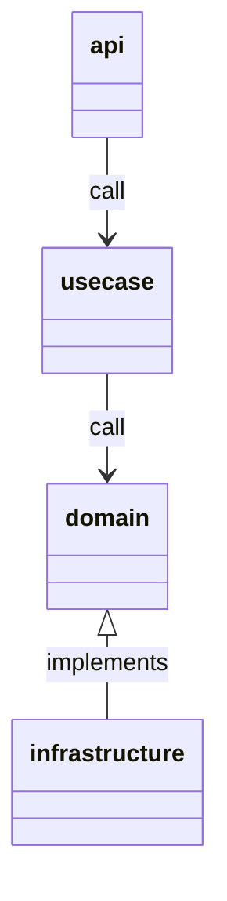

# realworld-echo

## Quickstart

```console
make init
go run .
```

## Libraries

| lib                                                                                   | use                            |
| ------------------------------------------------------------------------------------- | ------------------------------ |
| [uber-go/zap](https://github.com/uber-go/zap)                                         | logging                        |
| [labstack/echo](https://github.com/labstack/echo)                                     | web framework                  |
| [deepmap/oapi-codegen](https://github.com/deepmap/oapi-codegen)                       | schema base OAS code generator |
| [cockroachdb/errors](https://github.com/cockroachdb/errors)                           | error utility                  |
| [google/go-cmp](https://github.com/google/go-cmp)                                     | test compare                   |
| [google/wire](https://github.com/google/wire)                                         | dependency injection           |
| [open-telemetry/opentelemetry-go](https://github.com/open-telemetry/opentelemetry-go) | tracing                        |
| [golang/mock](https://github.com/golang/mock)                                         | mocking                        |

## About Component

| component      | usage                                 |
| -------------- | ------------------------------------- |
| api            | API handler                           |
| usecase        | Implements application business logic |
| domain         | Implements domain logic               |
| infrastructure | Implements technical logic            |

### Diagram



## Testing

1. Should be cover 100% covarage
1. Should be separate test package as `xxx_test`
   - because it should be test how to use other package

## Tips

### Only first time

```console
go get -u github.com/golang/mock/mockgen/model github.com/google/wire/cmd/wire@v0.5.0
```
