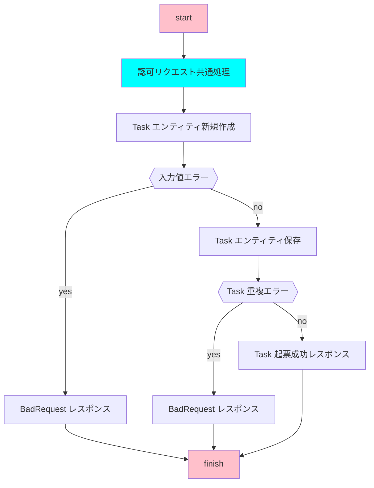

<!-- see: https://mermaid.js.org/syntax/flowchart.html -->
<!--
- styles
  - start
    - 処理開始プロセス
  - finish
    - 処理終了プロセス
  - [プロセス]
  - {{条件分岐}}
-->

# タスク登録

```mermaid
flowchart TD
    style start fill:pink
    style finish fill:pink
    classDef common fill:cyan

    start --> A[認可リクエスト共通処理]:::common
    A --> B[Task エンティティ新規作成]

    B --> C{{入力値エラー}}
    C --> |yes| D[BadRequest レスポンス]
    D --> finish
    C --> |no| E[Task エンティティ保存]

    E --> F{{Task 重複エラー}}
    F --> |yes| G[BadRequest レスポンス]
    G --> finish
    F --> |no| H[Task 起票成功レスポンス]
    H ---> finish
```
