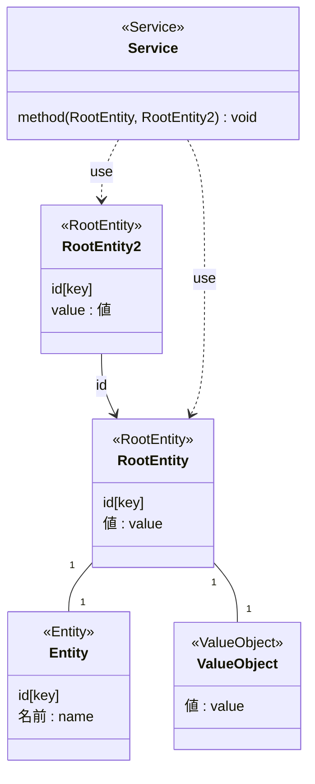

```mermaid
classDiagram
    class RootEntity {
        <<RootEntity>>
        %% エンティティのキーには[key]を付与
        id[key]
        %% 日本語表記 : 英語表記
        値 : value
    }
    class Entity {
        <<Entity>>
        id[key]
        名前 : name
    }
    class ValueObject {
        <<ValueObject>>
        値 : value
    }
    RootEntity "1" -- "1" Entity
    RootEntity "1" -- "1" ValueObject

    class RootEntity2 {
        <<RootEntity>>
        id[key]
        value : 値
    }
    RootEntity2 --> RootEntity : id

    class Service {
        <<Service>>
        method(RootEntity, RootEntity2) void
    }
    Service ..> RootEntity : use
    Service ..> RootEntity2 : use
```
