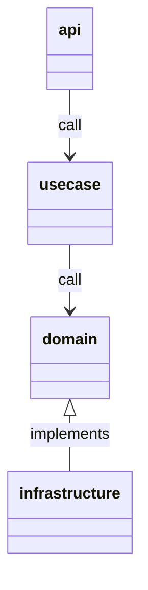

# realworld-echo

## Quickstart

```console
make init
go run .
```

## Libraries

| lib                                                                                   | use                            |
| ------------------------------------------------------------------------------------- | ------------------------------ |
| [uber-go/zap](https://github.com/uber-go/zap)                                         | logging                        |
| [labstack/echo](https://github.com/labstack/echo)                                     | web framework                  |
| [deepmap/oapi-codegen](https://github.com/deepmap/oapi-codegen)                       | schema base OAS code generator |
| [cockroachdb/errors](https://github.com/cockroachdb/errors)                           | error utility                  |
| [open-telemetry/opentelemetry-go](https://github.com/open-telemetry/opentelemetry-go) | tracing                        |
| [go.uber.org/fx](https://uber-go.github.io/fx/)                                       | depedency injection            |
| [stretchr/testify](https://github.com/stretchr/testify)                               | testing utility                |

## Structure

| directory      | usage                                                                 |
| -------------- | --------------------------------------------------------------------- |
| api            | API handler                                                           |
| config         | Application configuration                                             |
| domain         | Implements domain logic                                               |
| infrastructure | Implements technical logic                                            |
| internal       | Utilities and library for application should not be used other module |
| pkg            | Utilities and library for application could be used other module      |
| resources      | Any resources for application                                         |
| server         | Server application main package                                       |
| usecase        | Implements application business logic                                 |

### Diagram



## Testing

1. Should be cover 100% covarage
1. Should be separate test package as `xxx_test`
   - because it should be test how to use other package
